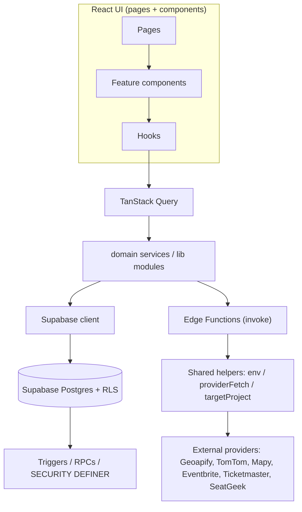

# Domain architecture

> **Status:** production prompt-pack integration baseline.
> This document maps the implemented domain boundaries of `src/features`, the backing
> Postgres source-of-truth objects and the Edge mutation boundaries. Legacy `src/lib`
> modules remain as compatibility implementations behind feature facades; this is an
> expand-contract refactor, not a route or API rewrite.

## Current top-level boundaries

```
src/
├── pages/            route-level containers (Index, Explore, Events, EventDetail, Profile,
│                     OrganizerDashboard, Admin, Auth, ResetPassword, About, NotFound)
├── components/       presentational + feature components
│   ├── admin/        admin surface (AdminEventbrite, AdminUsers, AdminCatalog, …)
│   ├── ui/           shadcn/ui primitives (button, card, dialog, tabs, …)
│   ├── venue/        venue suggestion surface
│   └── *.tsx         domain components (CreateEventDialog, EditEventDialog, HikePlanner,
│                     MapyTripPlanner, AddressAutocomplete, PlaceAutocomplete, …)
├── lib/              pure logic + data access helpers
│   ├── eventbrite.ts / external-events/    external event providers
│   ├── placeSearch.ts / searchProviderConfig.ts / awsLocation.ts / mapy.ts   places/geo
│   ├── organizer.ts / eventParticipantStats.ts                               organizer
│   ├── supabaseProjects.ts / env.ts / redirect.ts / utils.ts                 infra/safety
│   └── __tests__/    characterization + unit tests
├── hooks/            useAuth, useAdmin, useNotifications, useOrganizerMode, use-toast
└── integrations/supabase/   generated client + types
```

```
supabase/functions/
├── place-search/              (1306 LOC actual) provider orchestration + normalization
├── address-manager-*          (discovery / task-generator / worker)
├── sync-local-places/         (batch runner, providers/)
├── sync-external-events/ eventbrite-import/ sync-seatgeek-events/ sync-ticketmaster-events/
├── generate-hub-events/ virtual-hubs-admin/
├── admin-bulk-user-actions/ admin-user-profile-update/ mass-create-users/ seed-venues/
├── delete-account/ mapy-routing/
└── shared/                    env.ts, providerFetch.ts, targetProject.ts, adminAuth.ts
```

## Domain map (current responsibility)

| Domain | Frontend | Backend / Edge |
|---|---|---|
| Events | `pages/Events.tsx`, `EventDetail.tsx`, `CreateEventDialog.tsx`, `EditEventDialog.tsx`, `LeaveEventDialog.tsx` | RLS on `events`, `event_participants`; triggers (waitlist auto-promote, messages) |
| Organizer | `pages/OrganizerDashboard.tsx`, `pages/organizer/StatCards.tsx`, `lib/organizer.ts` | `generate-hub-events`, admin RPCs |
| Community / hubs | `components/UpcomingEventsReminder.tsx`, `lib/` notification prefs | `virtual_hubs`, `virtual_hub_members`, `generate-hub-events`, `virtual-hubs-admin` |
| Places / geo | `PlaceAutocomplete.tsx`, `AddressAutocomplete.tsx`, `VenueSuggestionsPanel.tsx`, `MapyTripPlanner.tsx`, `HikePlanner.tsx`, `ElevationChart.tsx`, `lib/placeSearch.ts`, `lib/searchProviderConfig.ts`, `lib/awsLocation.ts`, `lib/mapy.ts` | `place-search`, `address-manager-*`, `sync-local-places`, `mapy-routing` |
| External events | `lib/eventbrite.ts`, `lib/external-events/`, `components/admin/AdminEventbrite.tsx` | `sync-external-events`, `eventbrite-import`, `sync-seatgeek-events`, `sync-ticketmaster-events` |
| Admin | `pages/Admin.tsx`, `components/admin/*` | `admin-bulk-user-actions`, `admin-user-profile-update`, `mass-create-users`, `seed-venues`, admin RPCs |
| Identity / profile | `pages/Profile.tsx`, `pages/Auth.tsx`, `pages/ResetPassword.tsx`, `ChangePasswordCard.tsx`, `DeleteAccountCard.tsx` | `delete-account`, `admin-user-profile-update` |
| Notifications | `hooks/useNotifications.tsx`, `components/NotificationBell.tsx`, `NotificationPreferencesCard.tsx` | notification triggers in migrations |

## Implemented domain service layer (`src/features/*`)

The public feature facades are the supported imports for route and component code. Existing
`src/lib` modules remain temporarily available for backward compatibility and are not a second
definition of domain contracts.

```
src/features/
├── events/           scoped query keys + lifecycle/atomic mutation facade
├── organizer/        scoped query keys + readiness/check-in/operations facade
├── community/        canonical contracts + repository + idempotent Circle/Hub commands
├── admin/            operations/capability facade + scoped query keys
├── places/           normalized place contract + deterministic query keys
├── external-events/  provider DTO adapters → normalized domain DTOs
├── notifications/    notification taxonomy/deep-link contract + scoped query keys
└── identity/         onboarding, auth-error and session-device policy
```

`Community.tsx` and the place consumers use these boundaries directly. The event, organizer,
admin and notification facades preserve existing imports while their consumers are migrated in
small characterized changes. Query keys are domain-scoped so invalidation cannot accidentally
flush unrelated data.

## Domain ownership and source-of-truth map

| Domain | Source-of-truth | Safe/public DTO | Mutation boundary | Async/provider dependency | Owner modules |
|---|---|---|---|---|---|
| Identity | `profiles`, `profile_hobby_preferences`, `user_session_devices`, `data_subject_requests` | `public_profile_cards`, `get_event_participant_cards` | identity/privacy RPCs; Auth API | Auth session events; deletion/export operator worker | `features/identity`, `Profile`, `Onboarding` |
| Event | `events`, `event_operation_audits` | event list/detail selects; event-operations typed response | `event-operations` Edge + atomic lifecycle RPCs | scheduled reminders; external-event reconciliation | `features/events`, `lib/eventOperations` |
| Attendance | `event_participants` | aggregate participant counts; allowlisted organizer cards | join/cancel/transition/complete RPCs | waitlist promotion + completion hooks | `event-operations`, `features/organizer` |
| Social graph | `event_encounters`, `reconnection_preferences`, `connections`, `user_blocks` | `get_my_reconnection_candidates`, `get_my_connection_cards` | reconnection/block RPCs | event completion creates eligible encounters | `features/community`, `lib/socialGraph` |
| Circle / Hub | `social_circles`, `social_circle_members`, `virtual_hubs`, `virtual_hub_members` | `virtual_hub_discovery_cards`, `circle_health_dashboard` | consent/lifecycle/reconciliation RPCs | scoped hub reconciliation worker | `features/community`, `virtual-hubs-admin` |
| Organizer | `event_crew_roles`, `organizer_readiness_assessments`, `event_series`, `organizer_incident_handoffs` | readiness/participant operation results | organizer and event-operation RPCs | reminder jobs and check-in replay queue | `features/organizer`, `OrganizerDashboard` |
| Discovery | `discovery_preferences`, `discovery_preference_history` | explainable ranked cards | discovery-feedback Edge/RPC | recommendation evaluation only; no sensitive-state inference | `lib/recommendationEngine`, `discovery-feedback` |
| Notification | `notifications`, `notification_preferences`, `notification_delivery_attempts`, `notification_templates` | sanitized notification record + deep link | notification-preferences RPC/Edge; queue claim worker | digest/quiet-hour/retry worker | `features/notifications`, `lib/notificationPlatform` |
| External providers | external event tables plus `external_provider_state`, `external_provider_sync_runs` | `ExternalEventNormalized` with provenance | provider-specific sync Edge functions | Eventbrite, Ticketmaster, SeatGeek, Geoapify, TomTom | `features/external-events`, `shared/externalEventPipeline` |
| Moderation | `user_reports`, `moderation_cases`, `moderation_actions`, `safety_enforcements`, `moderation_appeals` | minimum case queues; no reporter-private payload in consumer UI | trust-safety Edge and audited RPCs | retention/deletion receipt worker | `lib/trustSafety`, `AdminModeration` |
| Billing / entitlement | `product_plans`, `plan_features`, `entitlement_grants`, `billing_provider_events` | server-evaluated entitlement result | entitlement RPCs; signed provider event ingest | payment provider hookup remains fail-closed until configured | `lib/entitlements`, `AdminProductOutcomes` |
| Admin / Ops | `admin_capabilities`, `admin_role_capabilities`, `admin_audit_log`, `operations_inbox_items` | capability-filtered operations view | `admin-control-plane` Edge + four-eyes RPCs | SLA inbox worker | `features/admin`, `AdminOperations` |

All browser-facing provider data crosses a normalization layer. Provider-native DTOs are
contained in `lib/external-events/*`, `shared/ticketmaster.ts`, `shared/seatgeek.ts` or the
place-search adapter and never become the core Event/Place DTO. Every new write boundary uses a
dedupe constraint, explicit idempotency key, or deterministic command identifier.

## Known large modules (actual LOC, measured 2026-08-20)

| Module | Actual LOC (measured) | Refactor status |
|---|---|---|
| `supabase/functions/place-search/index.ts` | 1306 | deferred — needs Deno harness (R-03) |
| `src/components/admin/AdminEventbrite.tsx` | 982 | partial (helpers extracted v1.7.3) — per-provider split deferred |
| `src/pages/Events.tsx` | 921 | deferred — needs characterization |
| `src/components/admin/AdminUsers.tsx` | 811 | deferred — active bulk-user flow |
| `src/components/CreateEventDialog.tsx` | 628 | deferred — form state must stay consolidated |
| `src/pages/OrganizerDashboard.tsx` | 627 | partial (StatCards extracted v1.7.3) |
| `src/lib/placeSearch.ts` | 358 | **this pass:** pure helpers exported + characterized (16 tests) |

> Note: the prompt pack's listed LOC values (e.g. place-search 1455) were measured on an older
> snapshot; the values above are the **actual** line counts verified in this pass.

## Dependency flow (Mermaid)



## Safety invariants (non-negotiable)

1. `place-search` response shape stays backward-compatible during refactors.
2. Admin bulk-user / hub-management / organizer-wizard flows are **not** touched without
   characterization tests.
3. Direct `.from()` calls in components are migrated to domain services only with a
   behavior-identical move + a locking test in the same change.
4. External provider DTOs must be normalized to domain DTOs before reaching components.
5. New `as any` is forbidden; legacy casts are replaced only in changes that ship a test.
